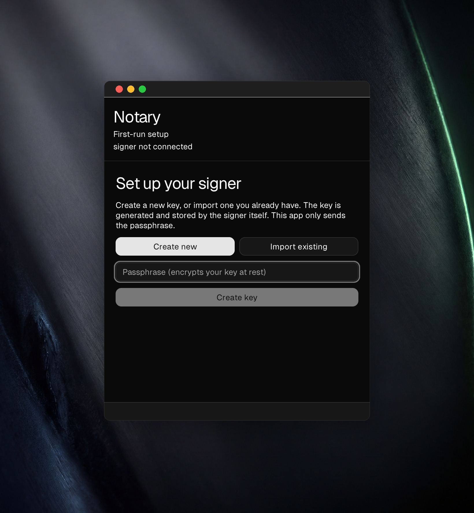
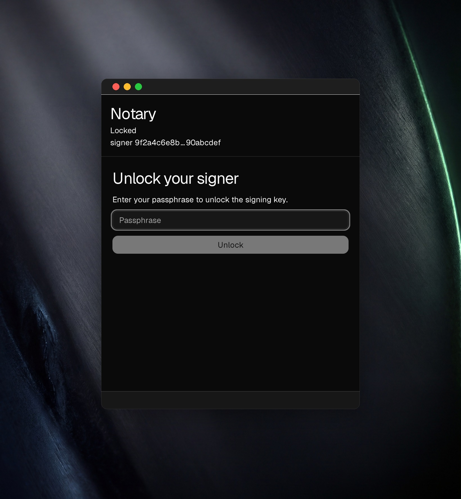
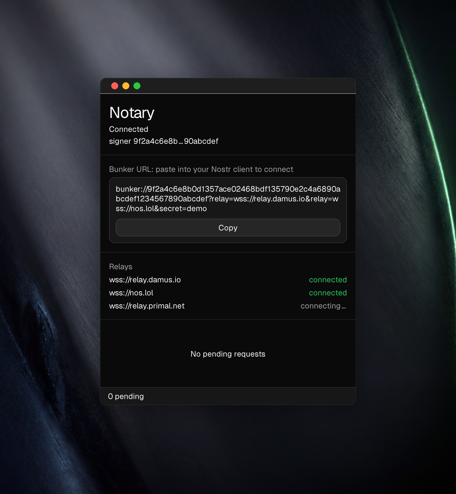
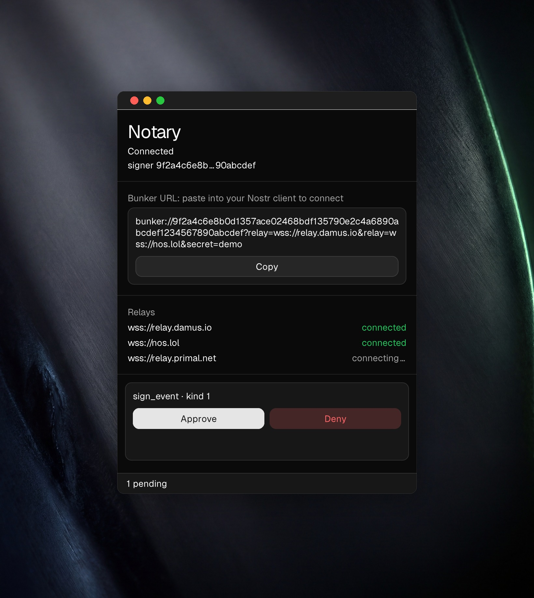

# Notary

**A native remote signer for [Nostr](https://nostr.com).** Not a web app in a
window: Zig throughout, drawn by the toolkit itself, with no Electron and no
WebView anywhere. Notary keeps your secret key on a machine you control and
signs for your apps over
[NIP-46](https://github.com/nostr-protocol/nips/blob/master/46.md). The key
never leaves the signer, and nothing gets signed quietly: you see what a client
is asking for before it happens.

Built on [`zig-nostr/nostr`](https://github.com/zig-nostr/nostr).

> **Status: early / work in progress.** The signer works end-to-end over public
> relays, including those that require NIP-42 authentication. Downloads are
> ad-hoc signed (not notarized). See [Install](#install).


<sub>First-run key setup, then the serving screen: the `bunker://` connection URL
to copy into a client, live per-relay status, and approving a real NIP-46 signing
request. The key is generated and held by the signer daemon. It never enters the
GUI.</sub>

## The whole app

Four screens, which is all of it.

| | |
| --- | --- |
|  |  |
| **Set up.** Create a key or bring one you have. The key is generated and stored by the signer daemon; the app only ever sends the passphrase. | **Unlock.** The key is encrypted at rest. Nothing serves until you unlock it. |
|  |  |
| **Serve.** Copy the `bunker://` URL into any Nostr client. Each relay reports its own connection state, so you can see where you are reachable. | **Approve.** Every request names itself and waits. Nothing is signed while you are not looking. |

<sub>Real windows, photographed from the running app against a backdrop. Every
pixel inside the window is the app's own.</sub>

## Install

**macOS (Apple Silicon):**

```sh
curl -fsSL https://raw.githubusercontent.com/zig-nostr/notary/main/scripts/install-macos.sh | bash
```

That downloads the latest release, verifies its SHA-256, installs `Notary.app`
to `/Applications`, and opens it, ready to use.

Notary is **ad-hoc signed, not notarized**, on purpose. It holds your keys, so
the trust anchor is a build you can reproduce, not an Apple signature: every
release is built by CI from a tagged commit
([`.github/workflows/release.yml`](.github/workflows/release.yml)). Prefer to
trust nothing you didn't run? Read the
[installer](scripts/install-macos.sh) and [build from source](#build).

## Two components, one product

Notary is split into two processes on purpose, so the secret key stays isolated
from the user interface:

- **[`daemon/`](daemon)**: the headless NIP-46 signer ("bunker"). It holds the
  encrypted key, connects to your relays, and in GUI mode serves a
  **loopback-only** approval API. It runs standalone as a CLI for advanced users,
  or supervised by the GUI.
- **[`gui/`](gui)**: the native desktop approver, built with the
  [Native SDK](https://github.com/vercel-labs/native) (declarative markup plus
  Zig, rendered natively: no WebView, no Electron). It shows each pending
  request and sends back your approve/deny decision. The key never enters it.

Packaged together, one download brings up both as a single macOS `.app`.

## Build

Each component builds independently. See its own README for details:

```sh
# daemon (Zig 0.16)
cd daemon && zig build -Doptimize=ReleaseFast

# gui (Native SDK CLI: npm install -g @native-sdk/cli)
cd gui && native build
```

- [`daemon/README.md`](daemon/README.md): running the signer, key management,
  relays, and the approval API.
- [`gui/README.md`](gui/README.md): the approval app and how it connects to (or
  supervises) the daemon.

## License

MIT © Sepehr Safari
