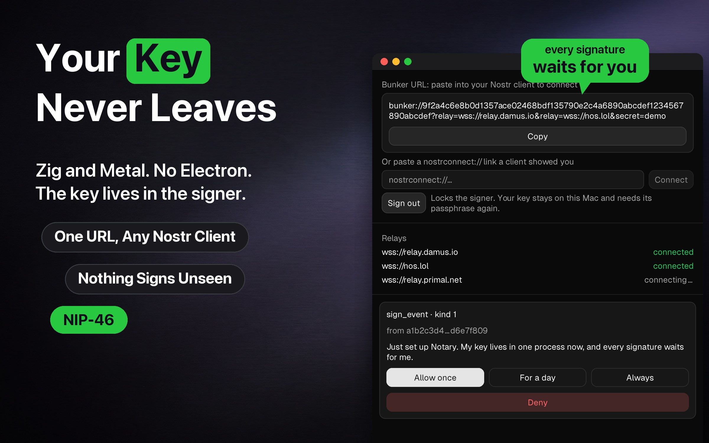
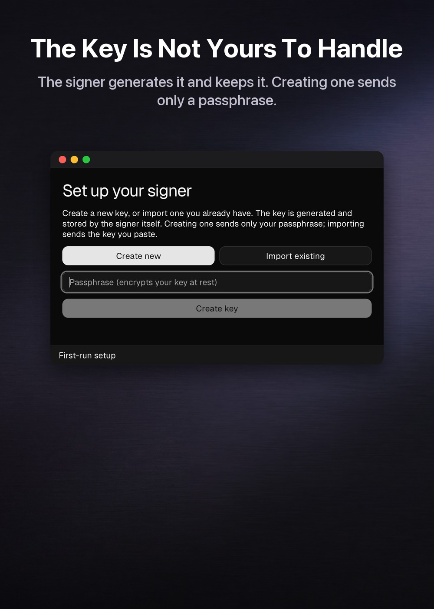
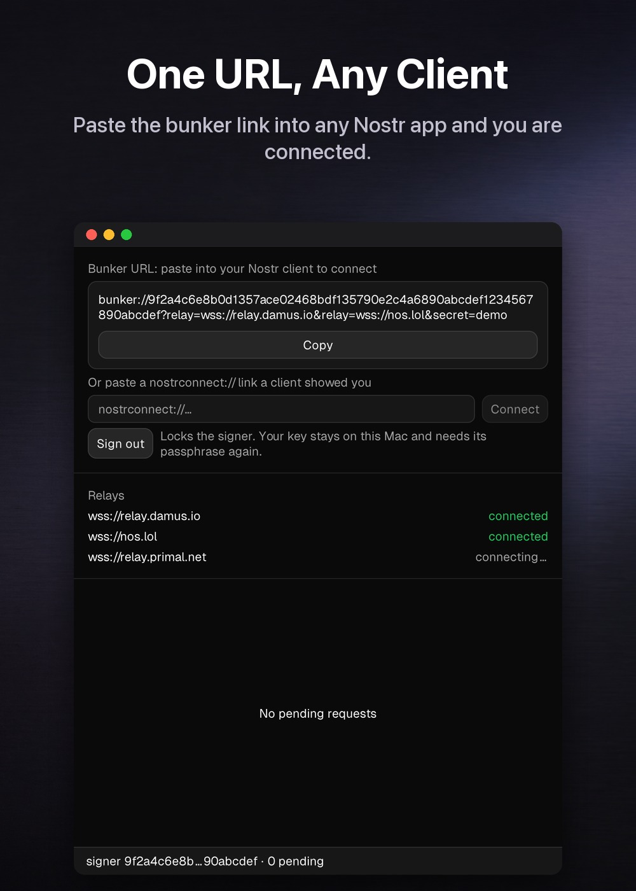
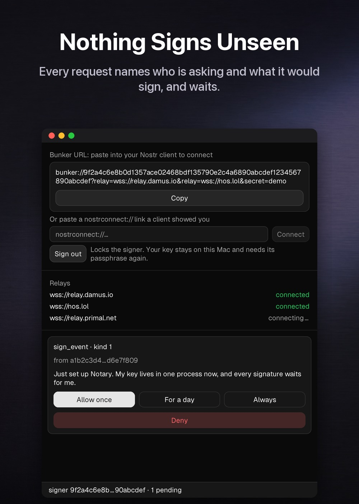

# Notary

**A native remote signer for [Nostr](https://nostr.com).** Not a web app in a
window: Zig throughout, drawn by the toolkit itself, with no Electron and no
WebView anywhere. Notary keeps your secret key on a machine you control and
signs for your apps over
[NIP-46](https://github.com/nostr-protocol/nips/blob/master/46.md). The key
never leaves the signer, and nothing signs on your behalf until you have said
so: a request shows which client is asking and what it would sign, and your
answer stands for that one request, for a day, or always for that client and
that kind.

Built on [`zig-nostr/nostr`](https://github.com/zig-nostr/nostr), and the signer
behind [Plaza](https://github.com/zig-nostr/plaza), the native client in the same
ecosystem. Nothing here is tied to it: the `bunker://` URL works in any NIP-46
client, and Notary neither knows nor cares which one is asking.

> **Status: early / work in progress.** The signer works end-to-end over public
> relays, including those that require NIP-42 authentication. Downloads are
> ad-hoc signed (not notarized). See [Install](#install).



## What it does

| | | |
| --- | --- | --- |
|  |  |  |

<sub>Real windows, photographed from the running app. Every pixel inside the
window is the app's own, so nothing here shows a screen the app cannot draw. The
signer pubkey and `bunker://` URL come from a stub daemon; no real key appears in
any of them.</sub>

## Install

**macOS (Apple Silicon):**

```sh
curl -fsSL https://raw.githubusercontent.com/zig-nostr/notary/main/scripts/install-macos.sh | bash
```

That downloads the latest release, verifies its SHA-256, installs `Notary.app`
to `/Applications` (or `~/Applications` when that is not writable), clears the
download-quarantine flag so Gatekeeper does not stop an ad-hoc-signed build, and
opens it.

Notary is **ad-hoc signed, not notarized**, on purpose. It holds your keys, so
the trust anchor is a build you can reproduce, not an Apple signature: every
release is built by CI from a tagged commit
([`.github/workflows/release.yml`](.github/workflows/release.yml)). Prefer to
trust nothing you didn't run? Read the
[installer](scripts/install-macos.sh) and [build from source](#build).

## Two components, one product

Notary is split into two processes on purpose, so the secret key stays isolated
from the user interface:

- **[`daemon/`](daemon)**: the headless NIP-46 signer ("bunker"). It holds the
  encrypted key, connects to your relays, and in GUI mode serves a
  **loopback-only** approval API. It runs standalone as a CLI for advanced users,
  or supervised by the GUI.
- **[`gui/`](gui)**: the native desktop approver, built with the
  [Native SDK](https://github.com/vercel-labs/native) (declarative markup plus
  Zig, rendered natively: no WebView, no Electron). It shows each pending
  request and sends back your answer: allow once, for a day, always, or deny.
  The key is generated and decrypted inside the daemon; this app forwards a
  passphrase, and an nsec only when you import an existing key on the setup
  screen. `signer import` reads it from the terminal instead, so it never
  touches the window at all.

Packaged together, one download brings up both as a single macOS `.app`.

## Build

Each component builds independently. See its own README for details:

```sh
# daemon (Zig 0.16)
cd daemon && zig build -Doptimize=ReleaseFast

# gui (Native SDK CLI: npm install -g @native-sdk/cli)
cd gui && native build
```

- [`daemon/README.md`](daemon/README.md): running the signer, key management,
  relays, and the approval API.
- [`gui/README.md`](gui/README.md): the approval app and how it connects to (or
  supervises) the daemon.

## License

MIT © Sepehr Safari
