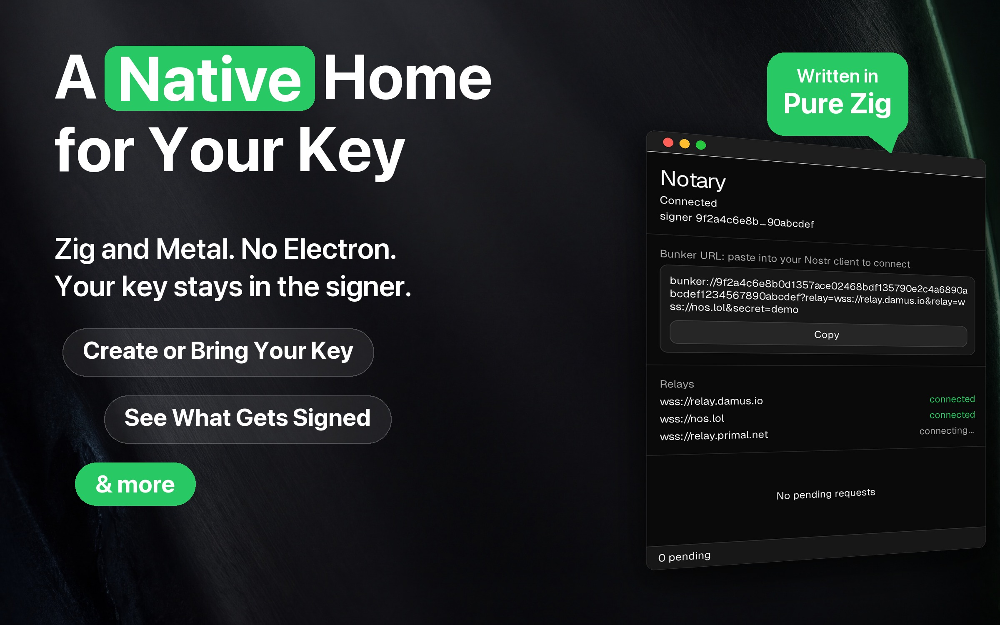
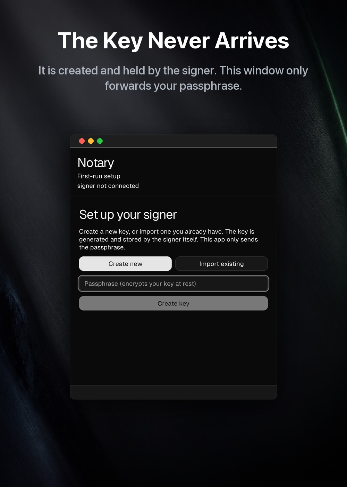
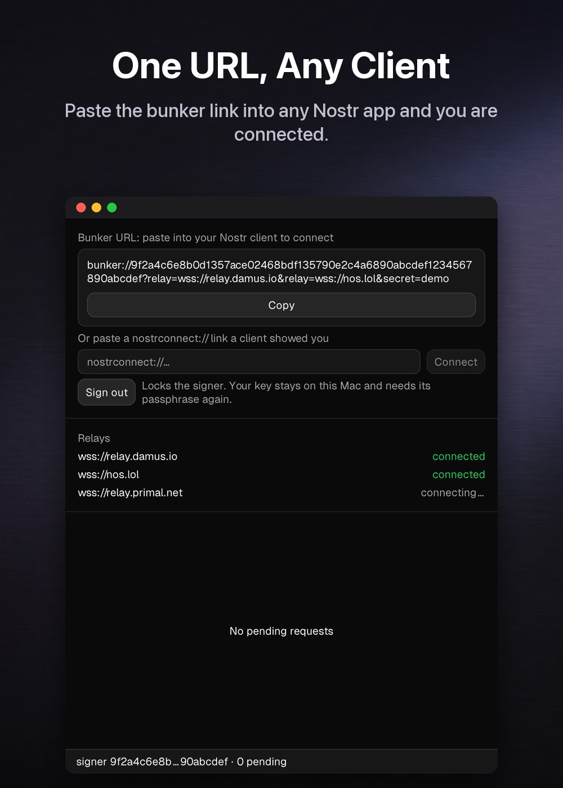
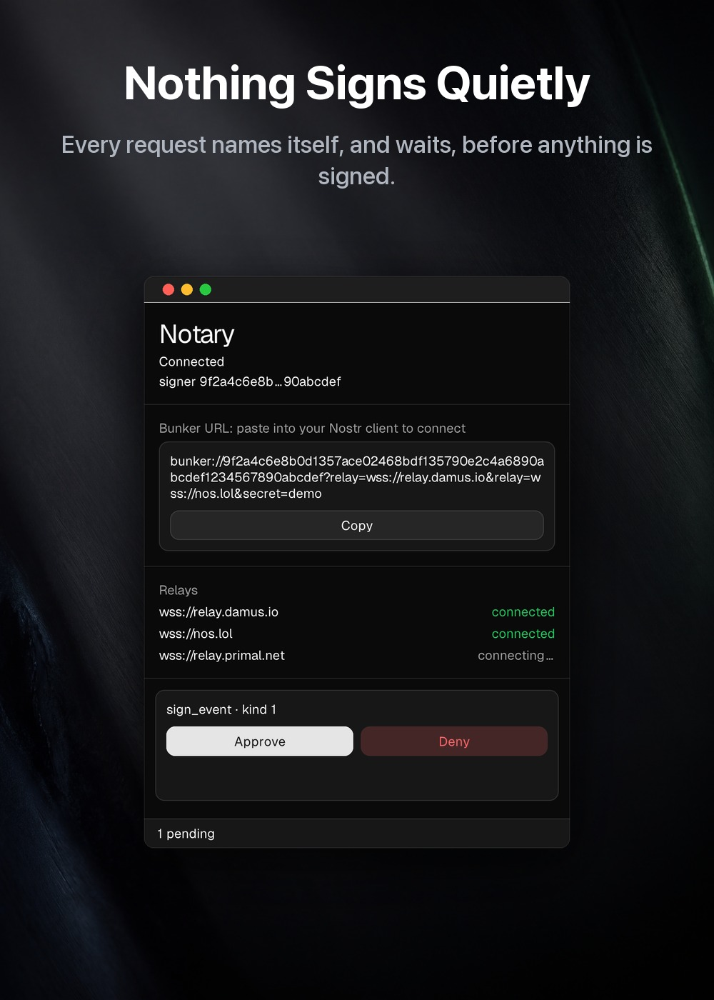

# Notary

**A native remote signer for [Nostr](https://nostr.com).** Not a web app in a
window: Zig throughout, drawn by the toolkit itself, with no Electron and no
WebView anywhere. Notary keeps your secret key on a machine you control and
signs for your apps over
[NIP-46](https://github.com/nostr-protocol/nips/blob/master/46.md). The key
never leaves the signer unless you ask for it, and nothing signs on your behalf
until you have said so: a request shows which client is asking and what it would
sign, and your answer stands for that one request, for a day, or always for that
client and that kind.

Built on [`zig-nostr/nostr`](https://github.com/zig-nostr/nostr), and the signer
behind [Plaza](https://github.com/zig-nostr/plaza), the native client in the same
ecosystem. Nothing here is tied to it: the `bunker://` URL works in any NIP-46
client, and Notary neither knows nor cares which one is asking.

> **Status: early / work in progress.** The signer works end-to-end over public
> relays, including those that require NIP-42 authentication. Downloads are
> ad-hoc signed (not notarized). See [Install](#install).

## Install

```sh
curl -fsSL https://raw.githubusercontent.com/zig-nostr/notary/main/scripts/install.sh | bash
```

That works on macOS (Apple Silicon) and Linux (x86_64 and aarch64). It downloads the latest release for your system, checks it against the SHA-256 published beside it, installs it and starts it: `Notary.app` goes to `/Applications` (or `~/Applications` when that is not writable) on macOS, and everything goes under `~/.local` on Linux, so nothing needs root.

- Linux needs GTK 4 and a recent distribution: Ubuntu 23.10+, Debian 13+ or Fedora 39+. Ubuntu 22.04 and Debian 12 are too old for the GTK 4.10 the toolkit needs. The installer checks both before it downloads anything.
- The macOS build is ad-hoc signed, not notarized, on purpose. Notary holds your key, so the trust anchor is a build you can reproduce rather than an Apple signature: every release is built by CI from a tagged commit ([`release.yml`](.github/workflows/release.yml)). The installer clears the download-quarantine flag so Gatekeeper lets it open. Read the [installer](scripts/install.sh), or [build from source](#build).
- On macOS, Notary keeps running in the menu bar after its window is closed, so choose **Quit Notary** there before you install over it. The installer stops and says so if it finds it running.
- Options go after `bash -s --`, as in `curl -fsSL .../install.sh | bash -s -- --version v0.11.2`. `--version <tag>` installs a named release, `--archive <file>` installs a release file you already have with no network (a `.sha256` beside it is checked), `--prefix <dir>` installs somewhere else, and `--no-open` installs without starting it.

The old `install-macos.sh` and `install-linux.sh` addresses still work: they run this installer.



## What it does

| | | |
| --- | --- | --- |
|  |  |  |

<sub>Real windows, photographed from the running app. Every pixel inside the
window is the app's own, so nothing here shows a screen the app cannot draw. The
signer pubkey and `bunker://` URL come from a stub daemon; no real key appears in
any of them.</sub>

## Your key is yours to take

A nostr key cannot be replaced. If the only copy is on one Mac, losing the Mac
loses the account, so Notary will hand the key back to you: **Back up your key**,
then the passphrase, then one of two forms.

The **encrypted key** is the NIP-49 `ncryptsec1…` exactly as it sits on disk. It
is still behind your passphrase, so it is safe to keep in a password manager or
on paper. Keep the passphrase somewhere else.

The **secret key** is the `nsec1…` itself. Anyone who reads it becomes you, for
good, so it is there for the case where you need it and says as much when it
appears.

The passphrase is required for both, including the encrypted form that does not
strictly need it: an unlocked signer is the normal state, and whoever is at the
keyboard then is not necessarily the person who set it up. Nothing is kept
afterwards, and closing the panel takes the key off the screen with it.

## Staying in the background

On macOS, closing the window does not quit Notary. The signer keeps answering, and an `N` item in the menu bar shows how many requests are waiting. When a request arrives the window comes back to the front, and when you have answered the last one it goes away again. If you opened the window yourself, it stays open until you close it.

The menu bar item has **Open Notary** to bring the window back by hand and **Quit Notary** to stop. Quitting stops the signer Notary started, so nothing is left running with your key. If the signer stops by itself the window comes back and says so, rather than leaving a menu bar item that no longer answers anything.

Notary has no Dock icon on macOS. A window that another app opened for its own keyholder (Plaza does this) behaves as it always did: it has a Dock icon, and closing it ends the window and nothing else, because that keyholder belongs to the app that opened it. On Linux closing the window quits, because the toolkit's Linux host has no status item that could bring a hidden window back.

## Two components, one product

Notary is split into two processes on purpose, so the secret key stays isolated
from the user interface:

- **[`daemon/`](daemon)**: the headless NIP-46 signer ("bunker"). It holds the
  encrypted key and is one of two things, never both:

  **Standalone**, run by this app: a bunker on real relays, where a client
  proves who it is with its own keypair. That is where a request from another
  machine, or from somebody else's client, belongs.

  **Embedded**, started by an app that ships Notary: the private keyholder of
  that one app. It talks to its parent down a pipe it was handed at startup, on
  a port the kernel chose, and connects to no relay. Nothing else on the machine
  can reach it, because there is no name, no path and no well-known port to
  reach.

  Not both at once, deliberately. A keyholder that any local app can reach has
  to answer "which app is this", and on the desktop nothing can: file
  permissions separate users, not apps, so a credential in a file is readable by
  every app you run.
- **[`gui/`](gui)**: the native desktop approver, built with the
  [Native SDK](https://github.com/vercel-labs/native) (declarative markup plus
  Zig, rendered natively: no WebView, no Electron). It shows each pending
  request and sends back your answer: allow once, for a day, always, or deny.
  The key is generated and decrypted inside the daemon; this app forwards a
  passphrase, and an nsec only when you import an existing key on the setup
  screen. `signer import` reads it from the terminal instead, so it never
  touches the window at all.

Packaged together, so one download brings up both: a single `.app` on macOS, and
a tarball carrying the two binaries side by side on Linux. The window finds the
daemon beside its own executable either way.

## Build

Each component builds independently. See its own README for details:

```sh
# daemon (Zig 0.16)
cd daemon && zig build -Doptimize=ReleaseFast

# gui (Native SDK CLI: npm install -g @native-sdk/cli)
cd gui && native build
```

- [`daemon/README.md`](daemon/README.md): running the signer, key management,
  relays, and the approval API.
- [`gui/README.md`](gui/README.md): the approval app and how it connects to (or
  supervises) the daemon.
- [`ARCHITECTURE.md`](ARCHITECTURE.md): how the two processes work together, the
  daemon's modules, NIP-49 key storage, and the daemon supervision model.

## License

MIT © Sepehr Safari
